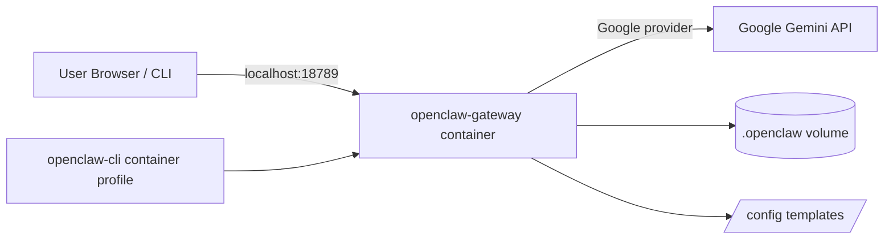

# Architecture

```mermaid
flowchart LR
  U[User Browser / CLI] -->|localhost:18789| G[openclaw-gateway container]
  G -->|Google provider| A[Google Gemini API]
  C[openclaw-cli container profile] --> G
  G --> V[(.openclaw volume)]
  G --> CFG[/config templates/]
```

## Notes
- `openclaw-gateway` is exposed only on `127.0.0.1`.
- `openclaw-cli` runs as optional helper profile.
- Runtime secrets come from `.env` only.
